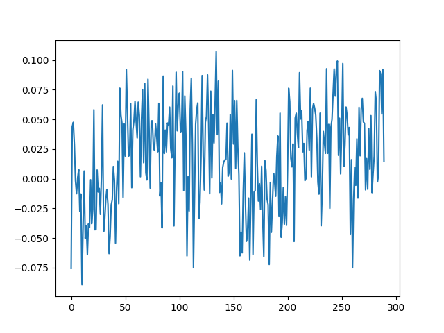

# Explainable AI
## Investication on NN working with features vectors input

The code provide a preliminary tool for investigate how the features influencing the output can be highlighted by 
Explinable AI tecniques. More precisely the approach proposed in the paper iNNvestigate Neural Networks!
and available at https://github.com/albermax/innvestigate, as been employed.
iNNvestigate proposes a tool for enabling the users to exploit Explainable AI techniques by means of 
a common interface and out-of-the-box implementation for many analysis methods.

The idea of our code is to allow user in generating a customized dataset of features vectors for 2 classes classification.
The customization stays in the possibility to set the amplitude of a range of features characterizing the class 0 
, the amplitude another range of features the characterizing the class 1, and the noise level of the whole dataset.

In this way, it is possible to avoid the uncertainty embedded in real dataset by the use of a "synthetic" and well 
controlled dataset.

# Installation
The code requires

- Python 2.7
- Keras 2.2.4
- Numpy 1.16
- Tensorflow 1.8
- Pandas 1.2.3
- Matplotlib
- Sklearn
- Moreover the line "beckend: TkAgg" could be required to be added in 
 "matplotlib/mpl-data/matplotlibrc" if working on virtual environment.
 
 # Files description
 
 - dataset_generator.m : It is a Matlab script devoted to the customization and the generation of 
 the dataset. A porting on python is scheduled to be done.
 - array_invest.py : allows the training of the model on the provided datasets and the test on the validation dataset
  exploiting the explainable AI analysis
 - single_pred.py : allow the analysis and visualization of a specific features vector in the validation dataset.
 
 # Example Analysis 
 
 A possible analysis is provided in the subsequent files:
 
 mytrain.csv and myval.csv: example of training and validation dataset.
 model_cc: a model trained on mytrain.csv
 exai_output.txt: Output of the analysis on the datasets mytrain.csv and myval.csv
 
 In this case the dataset has been created assuming a features vector of 290 features.
 Each features vector has been made up by white gaussian noise with a factor of 10.
 The class 0 vectors has been defined by adding the value of 50 at each of the features between the 1-st and 45-th
 indexes whereas the class 1 vectors has been defined by adding the value of 50 at each of the features between 
 the 156-st and the 200-th indexes.
 
 More precisely, a train datset of 10000 features vector and a verification dataset of 5000 features vector
  have bene created.
 
 
 
 The figure shows the averaged output over the whole verification dataset. It is possible to note as the components in
 the range 0 - 45 and 150 - 200 presents a different behavior.
 
 Such an investigation approach allow to understand how the variables determining the outputs
 are highlighted by the explainable AI methods and then better interpret their results 
 when real dataset are applied.